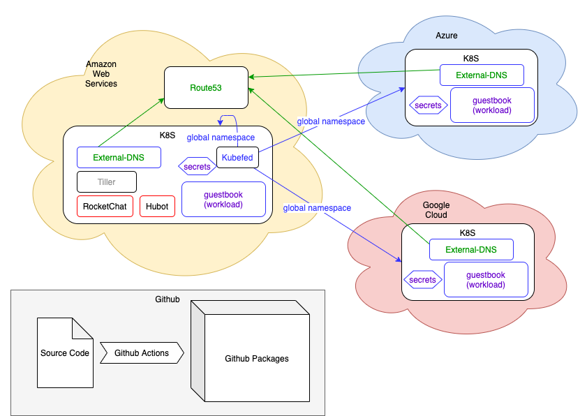

## Kubernetes Multicluster CICD

Greg Reboul 2020

-v-
### What
* IaC cluster provisionning
* Using 3 major public clouds
* Spread out deployment
* Full modern CI/CD pipeline

-v-
### //deployment
>Using Terraform, deploy two kubernetes clusters in two major cloud providers across two different global regions.

>Use Global Load Balancing to route traffic between the two clusters.

>Deploy a stateful containerized application across both clusters.
-v-
>Automate the deployment of the application using tools of your
choice.

>Integrate the deployment pipeline operations into a chat-ops tool.

>Perform blue/green deployment of the application across both
clusters.

-h-
## Overall solution

-v-

-h-
## Hybrid Cluster Setup

> Not covered in this presentation:
> * Cloud accounts setup
> * Tools setup
> * DNS setup
-v-
### Providers and Regions
* GCP - Sydney, Australia
* AWS - Sao Paulo, Brazil 
* Azure - Toronto

-v-
### Terraform
> Maintains a local state
> convenient for uninstalling
> and incremental updates

snags:
* AWS sticky VPC
* Azure Loadbalancer delays
-v-
### Kubefed
new version of Kubernetes Federation (v2), still in alpha
>Creates a federation:
>
>FederatedResources on the host create Resources in target clusters.
>
>Override rules (patch style) allow fine-tuning per target.
-v-
snags:
* forced me to use Helm2 (which conflicts with latest Terraform)
* release deletion is buggy
* clusterrolebindings is not federated by default
-h-

## Global Load Balancing

### Route53 routing policies

* Simple
* Multivalue
* Geolocation
* Latency
* Weighted
* Failover

-v-

### snags:
* AWS Route53 API does not allow to create a default geolocation
* Chrome DNS cache not the most convenient
-v-

### External-DNS

* uses annotations to synchronize Services and Ingress with DNS records
* supports a lot of DNS services

-h-

## Stateful application
I cheated to not have to use Persistant Volumes... I used the *Guestbook* from *Google tutorials*

Redis is not synced across clusters, it would require an additional service
-h-
## Codebase and Integration
  Challenge: how to not leak sensitive data

>### Github Actions
>  Launched last August
>  Seems pretty good
>  Trick: you need to create at least one personal token
-v-
>### Github Registry
>  Launched last May
>
> **pro:** spares having another additional account (Dockerhub)
>
> **cons:** always requires authentication, even for public repos

-h-

## Chatops

>### Rocketchat
> Nice option to configure admin user, have not found a convenient way to bypass the registration screen yet
>
> Could not get extraEnv passed via the commandline

-v-
>### Hubot
> I have not found anything to manage K8s federations
> Custom script is not that bad, it gave me the opportunity to query KubeAPI directly
>
> Hacky solution to push the script without having to build my own image:
> * *kubectl cp*
> * *hubot-reload* script
-h-

## Not done due to time constraints:

 > Use a real stateful app with persistant volumes
 > Install an ingress for the deployments
 > Add a cluster scaling service
 > Write a Helm 3 chart for kubefed
 > Use more terraform
 > Improve the Hubot script to give real time feedback on deployments
 > Install kubernetes/dashboard & Prometheus
-v-

## Demo

    make create-cluster (~15min )
    make configure-cluster (~3min30 )
    make deploy-rocketchat (~4min30)
    make deploy-guestbook (~10s)

    <play with a new deployment>

    make undeploy-guestbook (~3min30)
    make undeploy-rocketchat (~10s)
    make remove-federation-members (~1min)
    make remove-federation-host (~40s)
    make destroy-cluster (~55min)

-h-
## Thank you

You can find the source code and this presentation at

https://github.com/gregov/arctiq-ext-mission/
